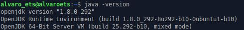

# Instalación NetBeans 8 en Linux

## Requisitos

El requisito principal es tener instalado el java:

## Instalación

Descargamos el enlace "jdk-8u111-nb-8_2-linux-x64.sh":

Vamos a la carpeta de descargas y damos permiso de ejecución

Ejecutamos el instalador

Se abrirá el instalador, en el que indicaremos la ruta de instalación de NetBeans:  

Después de indicar todo lo que nos pide comenzará la instalación

Por último, aparecerá la siguiente ventana que nos indica que la instalación ha finalizado.

